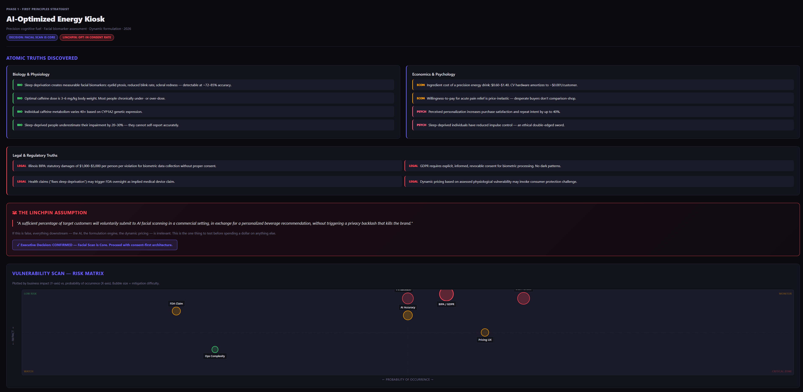

### The Business Idea Sprint Gauntlet

# 🚀 Business Idea Sprint

Welcome to the **Business Idea Sprint**—an autonomous, AI-driven gauntlet that transforms a raw startup
concept into a mathematically validated, pressure-tested, and deployable real-world test.

Powered by **Claude Code** and the **Agent Skills open standard**, this pipeline leverages advanced Prompt
Chaining, Context Engineering, and Multi-Agent Collaboration to prevent hallucinations and produce robust,
real-world ready results.

---

## ⚠️ Prerequisites

To run this pipeline, you **must have Claude Code installed** on your machine. Claude Code is an agentic coding
tool that lives in your terminal and executes these specialized frameworks.

---

## 📂 Directory Structure

In Claude Code, Custom Skills are filesystem-based directories. A skill is simply a folder containing, at
minimum, a `SKILL.md` file. To work correctly, this repository uses the following structure:

```text
my-startup-idea/
└── .claude/
    └── skills/
        ├── business-idea-sprint/
        │   └── SKILL.md
        ├── first-principles-strategist/
        │   └── SKILL.md
        ├── blue-ocean-strategy/
        │   └── SKILL.md
        ├── bmc-architect/
        │   └── SKILL.md
        ├── phase-1-synthesis/
        │   └── SKILL.md
        ├── initial-wedge/
        │   └── SKILL.md
        ├── investor-review/
        │   └── SKILL.md
        ├── customer-review/
        │   └── SKILL.md
        ├── realist-review/
        │   └── SKILL.md
        ├── macro-risk-analyst/
        │   └── SKILL.md
        ├── strategic-interrogation/
        │   └── SKILL.md
        ├── lanchester-go-to-market/
        │   └── SKILL.md
        └── mvp-test-strategist/
            └── SKILL.md
```
--------------------------------------------------------------------------------
🧠 The Framework Sequence
When you launch the orchestrator, it runs a 4-phase sequence. At critical bottlenecks, the pipeline halts
and uses the AskUserQuestion tool to force an executive "Go/No-Go" decision before proceeding.

Phase 1: Strategic Foundations
/first-principles-strategist: Strips your idea down to its fundamental physics and atomic truths, removing
industry jargon and lazy analogies.
/blue-ocean-strategy: Utilizes the Four Actions Framework (ERRC Grid) to map a differentiated value curve and
pivot your idea away from saturated "Red Oceans."
/bmc-architect: Constructs an AI-Enhanced 9-block Business Model Canvas to map out value creation and
delivery.
/phase-1-synthesis (Checkpoint): Digests the massive data from the first three steps into a tightly engineered
phase1_engineered_context.md file to prevent context degradation in the next phase.

Phase 2: Design the Initial Wedge
/initial-wedge: Uses the Jobs to Be Done (JTBD) framework and The Mom Test methodology to narrow your broad
idea into the smallest, most acute problem you can solve for a specific audience. Generates user-centric
validation prompts and early customer archetypes.

Phase 3: The Review Sprints (Parallel Agent Team)
Claude Code will seamlessly spawn an Agent Team of four independent subagents to ruthlessly critique the
approved_wedge.md simultaneously.
/investor-review: Evaluates market scale (TAM/SAM/SOM), Hamilton Helmer's 7 Powers (moats/defensibility), and
Unit Economics (LTV:CAC).
/customer-review: Analyzes ethnographic reality and the "Say-Do" gap, actively looking for points of high
friction where customers will drop off.
/realist-review: Conducts a Red Team "Pre-Mortem" to imagine the company has failed in 12 months and reverse-
engineers the fatal root cause.
/macro-risk-analyst: Scans for existential, macro-environmental threats using the PESTEL analysis framework.
/strategic-interrogation (Checkpoint): Synthesizes the parallel critiques into a 5-Domain factual summary.
Forces a definitive Go/No-Go decision before generating approved_strategy_synthesis.md and continuing.

Phase 4: Execution & Test Deployment
/lanchester-go-to-market: Applies Lanchester's Laws of concentration to identify a hyper-narrow beachhead
niche and single marketing channel for overwhelming local superiority.
/mvp-test-strategist: Rejects heavy software engineering in favor of a zero-code Minimum Viable Test (Smoke
Test, Concierge, or Wizard of Oz). Uses tool calling to physically generate your launch blueprint and test.
--------------------------------------------------------------------------------
🛠️ How to Install and Run (For Non-Technical Users)
You do not need to be a developer to run this, but you do need to use the terminal. Follow these simple
steps:
1. Create a workspace for your idea: Open your terminal (Command Prompt on Windows, Terminal on Mac) and create
a new folder for your project:
   mkdir test-idea
   cd test-idea
2. Copy the skills into your workspace: Download or clone this repository, and copy the .claude folder
directly into your new test-idea folder.
3. Start Claude Code: Run Claude Code from inside your test-idea directory:
   claude
4. Kick off the gauntlet: Once Claude is running and waiting for your prompt, type the following command to
start the master orchestrator, replacing the text in quotes with your actual business idea:
   /business-idea-sprint "I have an idea for an AI-powered logistics tool for mid-market food distributors."
Sit back and answer the questions when the pipeline halts at the executive checkpoints. By the end of the
sprint, you will have concrete Markdown data contracts, visual HTML dashboards, and deployable assets code.

